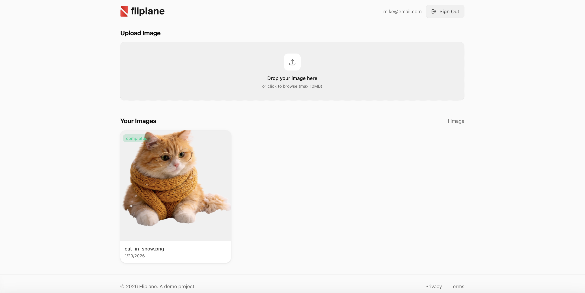

<div align="center">
  
  <h1>Fliplane</h1>
  <p>Modern AI-Powered Background Removal</p>
</div>

<div align="center">
  
</div>

Fliplane is a modern, AI-powered background removal tool built with Next.js. It allows users to upload images, automatically remove backgrounds, and manage their processed images through a personal dashboard.

## Features

- **AI Background Removal**: Instantly remove backgrounds from images.
- **User Authentication**: Secure sign-up and login via Supabase.
- **Image Dashboard**: specific user galleries to manage and view processed history.
- **Cloud Storage**: Secure image storage using S3-compatible services (Backblaze B2).
- **Responsive Design**: Modern UI built with Tailwind CSS v4.

## Tech Stack

- **Framework**: [Next.js 15+](https://nextjs.org/)
- **Language**: TypeScript
- **Styling**: [Tailwind CSS v4](https://tailwindcss.com/)
- **Backend/Auth**: [Supabase](https://supabase.com/)
- **Storage**: S3 Compatible (Backblaze B2)
- **Image Processing**: `sharp`

## Getting Started

1. **Clone the repository**

   ```bash
   git clone <repository-url>
   cd fliplane-project
   ```

2. **Install dependencies**

   ```bash
   npm install
   ```

3. **Set up Environment Variables**

   Create a `.env.local` file in the root directory with the following variables:

   ```env
   NEXT_PUBLIC_SUPABASE_URL=your_supabase_url
   NEXT_PUBLIC_SUPABASE_ANON_KEY=your_supabase_anon_key
   
   # Storage (S3/Backblaze)
   S3_ENDPOINT=your_s3_endpoint
   S3_REGION=your_region
   S3_ACCESS_KEY_ID=your_access_key
   S3_SECRET_ACCESS_KEY=your_secret_key
   S3_BUCKET_NAME=your_bucket_name
   
   # API Keys
   REMOVE_BG_API_KEY=your_api_key
   ```

4. **Run the development server**

   ```bash
   npm run dev
   ```

   Open [http://localhost:3000](http://localhost:3000) to view the application.
